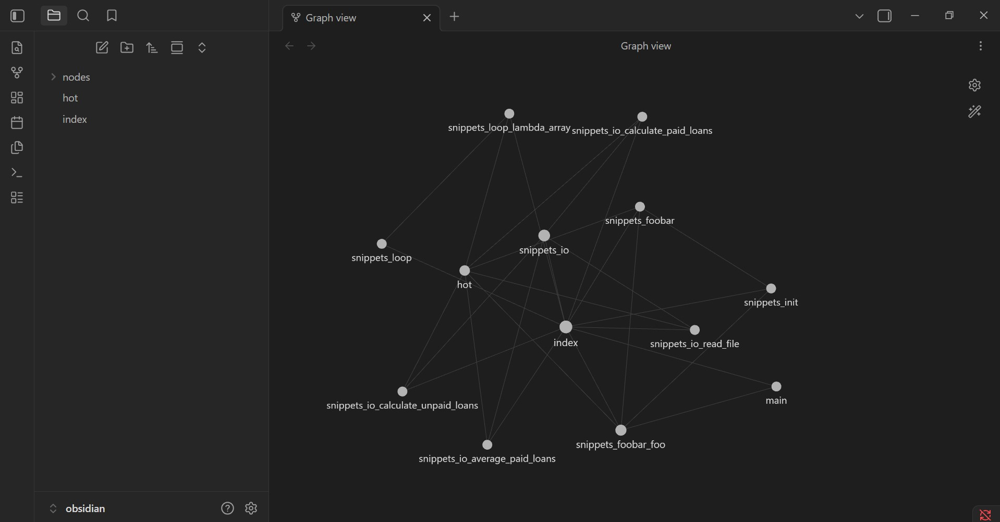

# ArchAgent

**Token-efficient architectural analysis & refactoring agent.** ArchAgent turns an
unfamiliar Python repo into a knowledge graph with **Grphify**, browses it in
**Obsidian**, and runs a multi-agent crew (LangGraph) to reverse-engineer the
architecture, detect structural smells, and **prove token savings** versus feeding raw
code to an LLM.

> **Status:** complete and run end-to-end on the target repo. The headline result —
> the graph-guided agent used **50.3% fewer tokens** than the raw-code baseline (above
> the 40% target), while both reached the bug's root cause with tests green. See
> [`reports/token_efficiency.md`](reports/token_efficiency.md).

Full spec: [`docs/PRD.md`](docs/PRD.md) · [`docs/PLAN.md`](docs/PLAN.md) ·
[`docs/TODO.md`](docs/TODO.md) · research questions [`docs/PRD_research_questions.md`](docs/PRD_research_questions.md).

---

## How it works

```
target repo ──> graphify extract ──> graph.json ──> GraphLoader ──> metrics + smells
                                          │                              │
                                          ▼                              ▼
                                   Obsidian vault              ranked recommendations
                                  (index/hot/notes)            (LangGraph agent crew)
                                          │
                          baseline (raw code) vs graph-guided  ──>  token study
```

The thesis (avoiding *Lost in the Middle*): reasoning over a compact **graph** +
curated notes is cheaper and sharper than dumping whole files at the model.

---

## Quick start

**Prerequisites:** Python 3.12, [`uv`](https://docs.astral.sh/uv/), and the Grphify CLI
(`uv tool install graphifyy`; the command is `graphify`). See
[`docs/GRAPHIFY_SETUP.md`](docs/GRAPHIFY_SETUP.md).

```bash
uv sync                                           # install
cp .env-example .env                              # then add ANTHROPIC_API_KEY=...
git clone https://github.com/andela/buggy-python data/target   # the target (git-ignored)
uv run python -m arch_agent                       # run the full pipeline
```

This loads `.env`, validates versions, then writes the deliverables to `artifacts/`,
`obsidian/`, and `reports/`. Grphify runs **code-only** (free, AST); the agent crew and
the token study use the configured model (`claude-sonnet-4-6`). Total cost on
buggy-python is a few cents.

---

## What the analysis found (this run)

The graph (11 nodes, 9 edges) made structure explicit that the file list hid:

- **God Node `snippets_io`** — the I/O layer everything routes through (centrality 0.40, fan-out 4).
- **God Node + SPOF `snippets_foobar_foo`** — an articulation point (fan-in 3): its removal disconnects the graph.

That central node is exactly where the canonical bug lives — a **mutable default
argument** (`def foo(bar=[])`). Structure pointed straight at the highest-risk code; full
trace in [`reports/root_cause.md`](reports/root_cause.md).

---

## Architecture (as extracted from the code)

- **Block diagram + OOP class map:** [`reports/architecture.md`](reports/architecture.md) (Mermaid, generated by `ReverseEngineer`).
- **Knowledge graph:** [`artifacts/graph.json`](artifacts/graph.json), [`artifacts/GRAPH_REPORT.md`](artifacts/GRAPH_REPORT.md), [`artifacts/graph.html`](artifacts/graph.html).

The system itself (C4 views, ADRs) is in [`docs/PLAN.md`](docs/PLAN.md): a thin CLI →
`ArchAgentSDK` → domain services (`graph_loader`, `metrics`, `cycles`, `smells`,
`reverse_engineer`, `obsidian_sync`, `efficiency`) + a LangGraph agent crew, all external
calls routed through an `ApiGatekeeper`.

## Agent workflow

A LangGraph `StateGraph`: **explore → analyse → recommend → report**. Five
single-responsibility agents (Explorer, Analyst, Architect, Refactor, Reporter) share a
base; every prompt is guarded to contain **graph artifacts only, never raw source**
(`agents/guards.py`). Spec: [`docs/PRD_agent_workflow.md`](docs/PRD_agent_workflow.md).

## How Grphify & Obsidian are used

- **Grphify** (`GrphifyRunner`) stages a code-only copy and runs `graphify extract` →
  `graph.json` (free AST). `graphify cluster-only` produced `GRAPH_REPORT.md` + `graph.html`.
- **Obsidian** (`ObsidianSync`) writes a browsable vault: [`obsidian/index.md`](obsidian/index.md)
  (entry point), [`obsidian/hot.md`](obsidian/hot.md) (high-fan-in nodes), and one
  `[[wikilinked]]` note per node so the graph view renders the dependency structure. Open
  the `obsidian/` folder as a vault to explore it.



More views (local graph, `hot.md`, backlinks) in [`reports/before_after.md`](reports/before_after.md#4-screenshots).

## Reverse-engineering process

`GraphLoader` parses graphify's node-link JSON (adapter in
[`graphify_adapter.py`](src/arch_agent/services/graphify_adapter.py)) into typed models;
`MetricsCalculator` computes fan-in/out, degree centrality, proximity (BFS), and
articulation points; `cycles.py` finds dependency cycles (Tarjan); `SmellDetector` ranks
God Node / SPOF / oversized / cyclic findings with evidence. Spec:
[`docs/PRD_graph_analysis.md`](docs/PRD_graph_analysis.md).

## Bug, root cause & fix

`def foo(bar=[])` reuses one list across calls (defaults evaluate once at def time); fix is
`bar=None` + `if bar is None: bar = []`. The hub module `snippets/io.py` also has line-level
bugs (`data("loans")`, `!==`, `sun`/`length` typos). Full analysis:
[`reports/root_cause.md`](reports/root_cause.md).

## Before / after & token efficiency

- **Before/after** (architecture, knowledge level, code): [`reports/before_after.md`](reports/before_after.md).
- **Token study** (baseline vs graph-guided, all metrics): [`reports/token_efficiency.md`](reports/token_efficiency.md) — **50.3% fewer tokens**.
- **Charts:** [`notebooks/results.ipynb`](notebooks/results.ipynb).

## Research questions

The eight EX04 research questions are answered with pointers in
[`docs/PRD_research_questions.md`](docs/PRD_research_questions.md).

## Extensions

Original analyses beyond the minimum are documented in
[`docs/EXTENSIONS.md`](docs/EXTENSIONS.md).

---

## Configuration

All thresholds/limits live in `config/*.json` (versioned `1.00`, validated at startup):
`setup.json` (target repo, model, smell thresholds, stop criterion), `rate_limits.json`
(gatekeeper), `logging_config.json`. No hard-coded values; API keys via `.env` only.

## Development

```bash
uv run ruff check .                              # lint (0 violations)
uv run ruff format --check .                     # format
uv run mypy                                      # type check (strict)
uv run pytest --cov --cov-report=term-missing    # tests + coverage (>=85%, currently 100%)
```

The same gates run in CI on every push/PR ([`.github/workflows/ci.yml`](.github/workflows/ci.yml)).

## Deliverables map

| Deliverable | Location |
|---|---|
| Solution code + agent workflow | `src/arch_agent/` |
| Grphify outputs | `artifacts/graph.json`, `GRAPH_REPORT.md`, `graph.html` |
| Obsidian vault | `obsidian/` |
| Bug analysis / root cause | `reports/root_cause.md` |
| Before/after | `reports/before_after.md` |
| Recommendations | `reports/recommendations.md` / `.json` |
| Token comparison | `reports/token_efficiency.md` |
| Block diagram + OOP map | `reports/architecture.md` |
| Charts | `notebooks/results.ipynb` |

## License

See repository for license terms.
