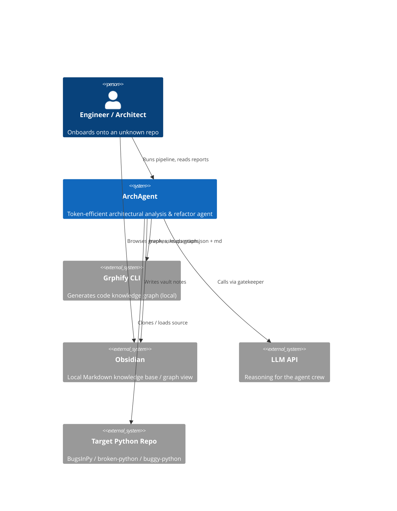
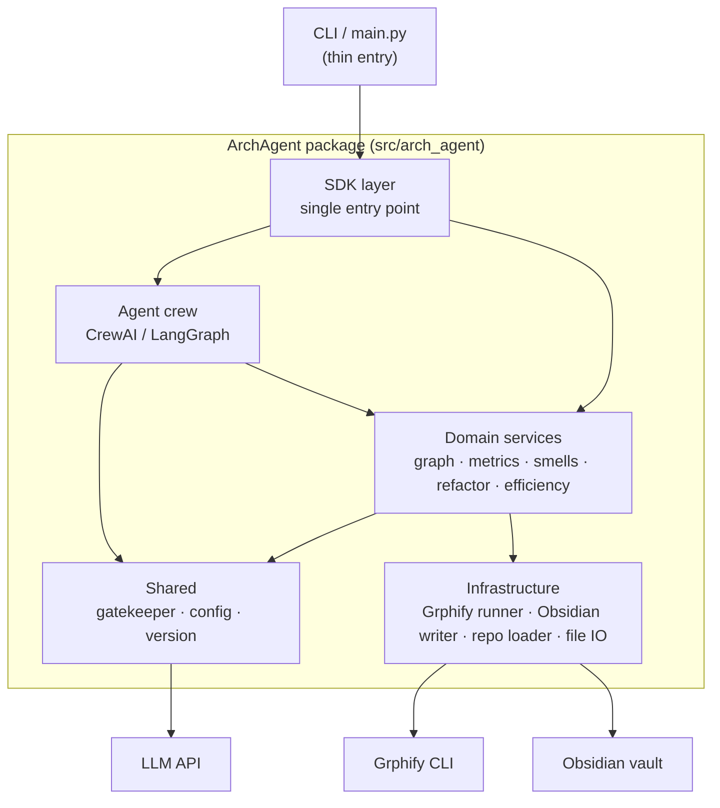
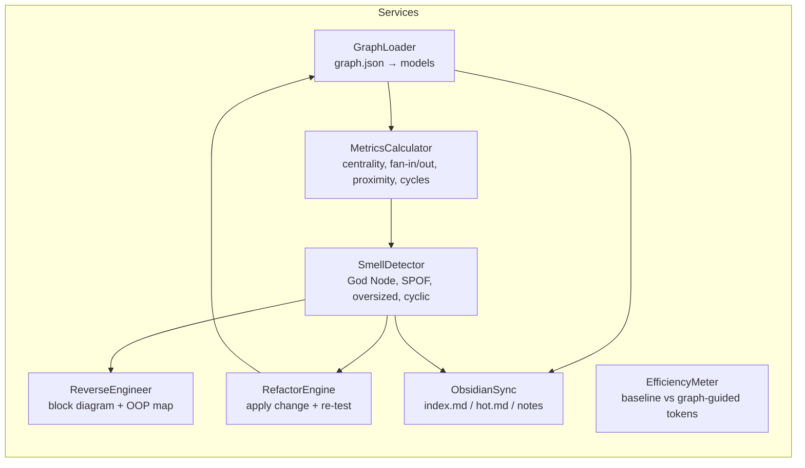
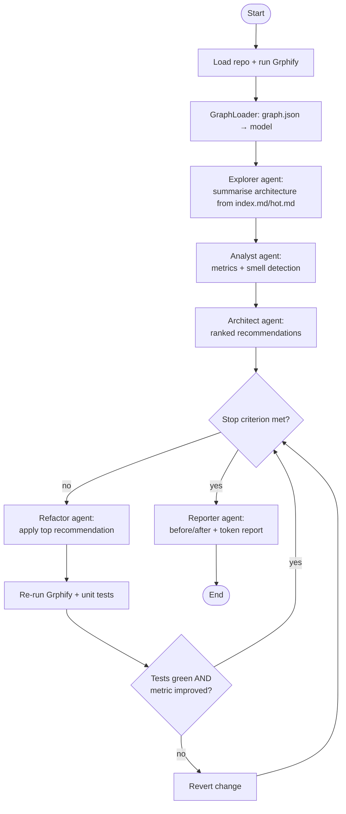

# PLAN — ArchAgent Architecture & Technical Design

| | |
|---|---|
| **Document** | Planning / Architecture Document (PLAN) |
| **Project** | ArchAgent |
| **Version** | 1.00 |
| **Date** | 2026-06-12 |
| **Status** | Draft — pending approval |

Companion to [`PRD.md`](PRD.md). Defines the C4 views, agent workflow, data
contracts, and the architecture decisions (ADRs) behind them.

---

## 1. C4 Model

### 1.1 Level 1 — System Context



### 1.2 Level 2 — Container



### 1.3 Level 3 — Component (domain services)



### 1.4 Level 4 — Code (key classes)

| Class | Responsibility | File (≤150 LOC) |
|---|---|---|
| `ArchAgentSDK` | Public façade for every operation | `sdk/sdk.py` |
| `GraphLoader` | Parse `graph.json` into `GraphModel` | `services/graph_loader.py` |
| `GraphModel`, `Node`, `Edge` | Typed graph data models | `services/models.py` |
| `MetricsCalculator` | Centrality / proximity / cycles | `services/metrics.py` |
| `SmellDetector` | Architectural smell rules | `services/smells.py` |
| `ReverseEngineer` | Block diagram + OOP class map | `services/reverse_engineer.py` |
| `RefactorEngine` | Apply refactor, re-graph, re-test | `services/refactor.py` |
| `EfficiencyMeter` | Token accounting baseline vs guided | `services/efficiency.py` |
| `ObsidianSync` | Write vault, `index.md`, `hot.md` | `services/obsidian_sync.py` |
| `GrphifyRunner` | Subprocess wrapper for Grphify | `infra/grphify_runner.py` |
| `RepoLoader` | Clone/load target repo | `infra/repo_loader.py` |
| `ApiGatekeeper` | Rate limit, queue, retry, log | `shared/gatekeeper.py` |
| `ConfigManager` | Load & version-validate config | `shared/config.py` |
| `AgentCrew` | Orchestrate the agents + loop | `agents/crew.py` |

---

## 2. Agent Workflow (UML Activity)



**Agent roles (each = single responsibility, a separate "expert"):**

| Agent | Role | Primary input | Output |
|---|---|---|---|
| Explorer | Understand the system | `index.md`, `hot.md` (not raw code) | architecture summary |
| Analyst | Find structural risk | `graph.json` metrics | ranked smells + evidence |
| Architect | Decide what to change | smells | ordered recommendations |
| Refactor | Execute a change safely | recommendation + source | patched code |
| Reporter | Communicate results | before/after artifacts | reports + token tables |

**Stop criterion (configurable):** loop ends when *any* holds — (a) max iterations
reached, (b) no recommendation improves the target metric beyond a threshold, or
(c) token budget cap reached. Defined in `config/setup.json`.

**Token-reduction mechanisms:**
1. Agents read **graph artifacts**, never whole files (avoids *Lost in the Middle*).
2. `hot.md` narrows attention to high-centrality / high-churn nodes only.
3. Recommendations reference node IDs; source is fetched lazily, only when refactoring.
4. All LLM calls pass the gatekeeper so retries/caching don't multiply cost.

---

## 3. Data Contracts

### 3.1 `graph.json` (consumed; Grphify output — illustrative schema)

```jsonc
{
  "version": "1.00",
  "nodes": [
    { "id": "mod.payments", "type": "module", "loc": 412, "centrality": 0.91 }
  ],
  "edges": [
    { "src": "mod.api", "dst": "mod.payments", "kind": "import" }
  ]
}
```

`type ∈ {module, class, function}`; `kind ∈ {import, call, inherit}`. The loader is
defensive: missing optional fields default, unknown fields are ignored.

### 3.2 `RecommendationReport` (produced)

```jsonc
{
  "generated_at": "2026-06-12T00:00:00Z",
  "findings": [
    {
      "smell": "god_node",
      "node": "mod.payments",
      "evidence": { "centrality": 0.91, "fan_in": 37 },
      "severity": "high",
      "recommendation": "Split mod.payments into payments.core + payments.io",
      "rationale": "Single point of failure; high coupling."
    }
  ]
}
```

### 3.3 Token-efficiency record (produced)

```jsonc
{
  "task": "summarise_architecture",
  "baseline":      { "in_tokens": 184320, "out_tokens": 2100, "usd": 0.94 },
  "graph_guided":  { "in_tokens": 41210,  "out_tokens": 1980, "usd": 0.22 },
  "savings_pct": 76.6
}
```

---

## 4. Interfaces

### 4.1 SDK (single entry point — every consumer goes through this)

```python
class ArchAgentSDK:
    def build_graph(self, repo: str) -> GraphModel: ...
    def sync_obsidian(self, graph: GraphModel) -> Path: ...
    def reverse_engineer(self, graph: GraphModel) -> ArchitectureDoc: ...
    def detect_smells(self, graph: GraphModel) -> list[Finding]: ...
    def run_crew(self, graph: GraphModel) -> RecommendationReport: ...
    def refactor_loop(self, repo: str) -> LoopResult: ...
    def measure_efficiency(self, repo: str, task: str) -> EfficiencyRecord: ...
```

### 4.2 Gatekeeper (all external calls)

```python
class ApiGatekeeper:
    def __init__(self, config: RateLimitConfig): ...
    def execute(self, api_call, *args, **kwargs): ...   # rate-limit → queue → retry → log
    def get_queue_status(self) -> QueueStatus: ...
```

---

## 5. Architecture Decision Records (ADRs)

### ADR-001 — Reason over the graph, not raw source
**Decision:** Agents consume `graph.json` / `index.md` / `hot.md`, not whole files.
**Why:** This is the assignment's core thesis (token efficiency + avoiding *Lost in the
Middle*). **Trade-off:** structural reasoning can miss line-level logic bugs — acceptable
because we target *architectural* issues. **Alternatives:** raw-code RAG (rejected: costly),
full-context dump (rejected: expensive and lower quality).

### ADR-002 — Orchestrator: LangGraph (CrewAI as fallback)
**Decision:** Use **LangGraph** for the agent workflow because the loop is an explicit
state machine (analyse → refactor → re-test → decide) that maps cleanly to a graph with a
conditional stop edge. **Trade-off:** more wiring than CrewAI's role abstraction.
**Alternative:** CrewAI (simpler roles, weaker loop control) — kept as a documented fallback
since the assignment accepts either.

### ADR-003 — Grphify invoked as a subprocess, not imported
**Decision:** Wrap the Grphify CLI behind `GrphifyRunner`. **Why:** keeps Grphify a
black-box dependency; we only depend on its file outputs, so the rest of the system is
testable with fixture `graph.json` files. **Trade-off:** subprocess overhead per run
(acceptable; runs are infrequent).

### ADR-004 — Refactor only after a green re-test gate
**Decision:** Every applied change must keep unit tests green *and* improve the target metric,
else it is reverted. **Why:** the agent must never silently break behaviour. **Trade-off:**
some valid refactors that temporarily fail tests are skipped — acceptable for safety.

### ADR-005 — Config-driven thresholds & rate limits
**Decision:** Centrality/God-Node thresholds, stop criteria, model name, and rate limits live
in `config/*.json`, versioned. **Why:** guideline mandate (no hard-coded values) and lets the
grader tune without code edits.

### ADR-006 — `uv` as the sole package manager
**Decision:** All install/run/test via `uv`. **Why:** guideline mandate + reproducibility
(`uv.lock`). **Trade-off:** none material.

---

## 6. Repository Structure (planned)

```
hw4_vibe_coding/
├── README.md
├── pyproject.toml          # build, ruff, coverage, deps
├── uv.lock
├── .env-example            # API key placeholders
├── .gitignore
├── config/
│   ├── setup.json          # target repo, model, thresholds, stop criterion (v1.00)
│   ├── rate_limits.json    # gatekeeper limits (v1.00)
│   └── logging_config.json
├── src/
│   ├── main.py             # thin CLI → SDK
│   └── arch_agent/
│       ├── __init__.py     # __version__, public exports
│       ├── constants.py
│       ├── sdk/sdk.py
│       ├── services/       # graph_loader, models, metrics, smells,
│       │                   # reverse_engineer, refactor, efficiency, obsidian_sync
│       ├── agents/         # crew.py, roles.py, loop.py
│       ├── infra/          # grphify_runner.py, repo_loader.py, file_io.py
│       └── shared/         # gatekeeper.py, config.py, version.py
├── tests/
│   ├── unit/               # mirrors src/, fixtures for graph.json
│   ├── integration/
│   └── conftest.py
├── obsidian/               # generated vault (index.md, hot.md, notes)
├── artifacts/              # Grphify output: graph.json, GRAPH_REPORT.md, html
├── reports/                # before/after + baseline-vs-guided token report
├── data/                   # cloned/sample target repo
├── notebooks/              # results analysis (charts: centrality, token savings)
└── docs/                   # PRD, PLAN, TODO, dedicated PRDs
```

---

## 7. Quality & Cross-Cutting Plan

| Concern | Approach |
|---|---|
| File size | Split by responsibility; each file ≤ 150 LOC. |
| OOP / DRY | Shared base for agent roles; gatekeeper wraps all API try/except. |
| Testing | TDD; fixture `graph.json`; mock LLM + subprocess; coverage ≥ 85 %. |
| Lint | `ruff check` = 0 (E,F,W,I,N,UP,B,C4,SIM). |
| Secrets | env vars only; `.env` ignored; `.env-example` committed. |
| Parallelism | Independent metric computations via thread/process pool (thread-safe, locked shared state). |
| Cost | `EfficiencyMeter` logs tokens; notebook summarises with charts. |
| Versioning | `version.py` + config `"version"` keys at 1.00; validated at startup. |

---

## 8. Risks & Mitigations

| Risk | Mitigation |
|---|---|
| Target repo won't set up (esp. BugsInPy) | Fall back to `andela/buggy-python`; document the switch; Docker option. |
| Grphify output schema differs from assumed | Defensive loader + schema test against a real sample early (M1). |
| Refactor breaks behaviour | Green-test gate + auto-revert (ADR-004). |
| Token savings not realised | Report honestly *why* (e.g. overhead of agent chatter) per the brief. |
| Loop never converges | Hard `max_iterations` + budget cap stop criterion. |
