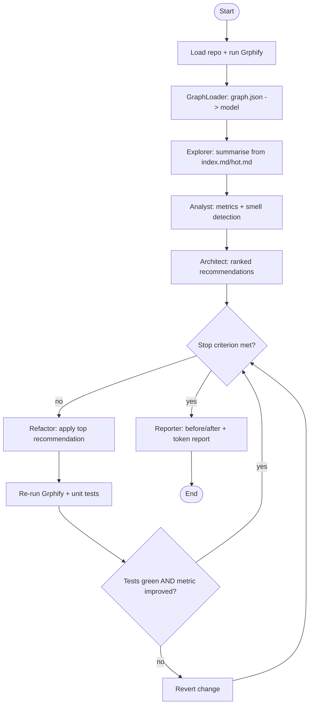

# Dedicated PRD — Agent Workflow (Crew, Loop & Stop Criterion)

| | |
|---|---|
| **Document** | Dedicated PRD — Agent Workflow |
| **Project** | ArchAgent |
| **Version** | 1.00 |
| **Date** | 2026-06-16 |
| **Status** | Draft — pending approval |

Companion to [`PRD.md`](PRD.md) (FR-8, FR-9, FR-11, FR-12, FR-16) and [`PLAN.md`](PLAN.md)
(§2 agent workflow, ADR-002/ADR-004). Specifies the agent **roles**, the orchestration
**loop**, the **stop criterion**, and the **context-reduction** mechanisms — enough to build
`agents/crew.py`, `agents/roles.py`, and `agents/loop.py` (TODO 3.2–3.5, 4.2–4.4) test-first.

---

## 1. Purpose & Scope

Orchestrate a multi-agent crew that consumes **graph artifacts** (not raw code), produces
ranked, evidence-backed refactoring recommendations, and drives the safe refactor loop until a
stop criterion is met.

- **In scope:** orchestrator choice, shared state, the five agent roles + their I/O, the
  analyse→recommend→refactor→re-test→decide loop, the stop criterion, gatekeeper routing,
  and the `RecommendationReport` output.
- **Out of scope:** metric/smell algorithms (`PRD_graph_analysis.md`), the refactor *edit*
  mechanics beyond the loop contract (`services/refactor.py`), and token *measurement*
  (`PRD_token_efficiency.md`).

---

## 2. Orchestrator — LangGraph (ADR-002)

LangGraph is the primary orchestrator: the loop is an explicit **state machine**
(analyse → refactor → re-test → decide) with a conditional stop edge, which maps cleanly to a
graph. CrewAI is a documented fallback (simpler roles, weaker loop control). Either satisfies FR-8.

---

## 3. Shared State

A single typed state object flows through the graph nodes (LangGraph state):

```jsonc
{
  "repo": "andela/buggy-python",
  "graph": "<GraphModel ref>",            // from GraphLoader (TODO 1.4)
  "findings": [ /* Finding[] from detect_smells, PRD_graph_analysis §5 */ ],
  "recommendations": [ /* ordered Recommendation[] */ ],
  "iteration": 0,
  "applied": [ /* history of applied/reverted changes */ ],
  "metrics_before": { "target_node": "mod.x", "centrality": 0.91 },
  "metrics_after":  { "centrality": 0.62 },
  "budget": { "tokens_used": 0, "tokens_cap": 200000 },
  "stop_reason": null                      // set when the loop ends
}
```

State is mutated only by node functions; agents never hold hidden global state (testability).

---

## 4. Agent Roles

Each agent is a **single responsibility** "expert" sharing a common base (`roles.py` base class:
prompt assembly, gatekeeper call, output parsing). No agent reads whole source files.

| Agent | Responsibility | Input | Output |
|---|---|---|---|
| **Explorer** | Understand the system | `index.md`, `hot.md` (curated, not raw code) | architecture summary |
| **Analyst** | Find structural risk | `GraphModel` metrics + `Finding[]` | ranked smells + evidence |
| **Architect** | Decide what to change | `Finding[]` | ordered `Recommendation[]` |
| **Refactor** | Execute one change safely | top recommendation + lazily-fetched source | patched code (via `RefactorEngine`) |
| **Reporter** | Communicate results | before/after artifacts | reports + token tables |

**`Recommendation`** (Architect output):

```jsonc
{
  "target": "mod.payments",
  "action": "split_module",                // split_module | invert_dependency | break_cycle | extract_interface
  "rationale": "God Node: centrality 0.91, fan_in 37 — single point of failure.",
  "expected_effect": "centrality(target) decreases",
  "priority": 1                            // 1 = apply first
}
```

---

## 5. Workflow & Loop



- The **re-test gate** (node `J`) enforces ADR-004: a change is kept only if the target's unit
  tests stay **green** *and* the target metric improves; otherwise it is **auto-reverted**.
- `iteration` increments each loop; `applied[]` records kept/reverted changes for the report.

---

## 6. Stop Criterion (config-driven, FR-12)

The loop ends when **any** condition holds (thresholds in `config/setup.json`, ADR-005):

```jsonc
{
  "agent_workflow": {
    "max_iterations": 3,
    "min_metric_improvement": 0.05,   // stop if best recommendation improves target < 5%
    "token_budget": 200000            // stop if cumulative tokens exceed cap
  }
}
```

`stop_reason ∈ {max_iterations, no_improvement, budget_exceeded, no_recommendations}` is recorded
in state and surfaced by the Reporter. The loop is therefore **deterministic and bounded**
(no infinite loops — PLAN risk mitigation).

---

## 7. Context-Reduction Mechanisms (the core thesis, ADR-001)

1. Agents read **graph artifacts** (`graph.json`, `index.md`, `hot.md`), never whole files
   (avoids *Lost in the Middle*) — verified by FR/test 3.5 (no whole-file dumps in prompts).
2. `hot.md` narrows attention to high-centrality / high-churn nodes only.
3. Recommendations reference **node ids**; source is fetched **lazily**, only when the Refactor
   agent acts on a specific node.
4. All LLM calls pass the **gatekeeper** (§8) so retries/queueing never multiply token cost.

These mechanisms are what `PRD_token_efficiency.md` later **measures** (graph-guided vs. baseline).

---

## 8. Gatekeeper Integration (FR-16)

Every external LLM call routes through `ApiGatekeeper.execute(...)` (rate-limit → queue → retry →
log). Agents never call the provider SDK directly. The gatekeeper records per-call `usage`
(input/output tokens), which feeds the `EfficiencyMeter`. Overflow **queues** rather than crashing.

---

## 9. Output Contract

The crew returns a **`RecommendationReport`** (aligns with `PLAN.md` §3.2):

```jsonc
{
  "generated_at": "2026-06-16T00:00:00Z",
  "repo": "andela/buggy-python",
  "findings": [ /* Finding[] */ ],
  "recommendations": [ /* Recommendation[] */ ],
  "loop": { "iterations": 2, "stop_reason": "no_improvement",
            "applied": [ {"target": "mod.x", "kept": true} ] },
  "metrics": { "target": "mod.x", "centrality_before": 0.91, "centrality_after": 0.62 }
}
```

Exposed via the SDK (`run_crew`, `refactor_loop` — PRD FR-15).

---

## 10. Safety, Determinism & Edge Cases

- **Safety:** green-test + improvement gate with auto-revert (ADR-004); the agent never silently
  breaks behaviour.
- **Determinism:** fixed recommendation ordering (priority, then severity, then node id); LLM
  temperature pinned low for reproducibility; the loop bound is config-driven.
- **Edge cases:** no findings ⇒ `stop_reason = no_recommendations`, empty loop, Reporter still runs;
  Grphify/test failure mid-loop ⇒ revert + continue or stop with recorded reason; budget hit
  mid-iteration ⇒ finish current step, then stop.

---

## 11. Testing (TDD, NFR-4)

- **Mock the LLM** (gatekeeper returns canned, typed responses) and **mock the subprocess**
  (Grphify + pytest) so the graph runs offline and deterministically.
- Assert: each agent's single-responsibility I/O; the loop honours the re-test gate (kept vs.
  reverted); each stop condition triggers with the right `stop_reason`; no prompt contains a
  whole-file dump (FR 3.5). Coverage ≥ 85 %.

---

## 12. Traceability

| This PRD | Satisfies |
|---|---|
| §4 roles | PRD **FR-8**, **FR-9**; TODO **3.2**, **3.4** |
| §5 workflow + re-test gate | PRD **FR-11**; ADR-004; TODO **3.3**, **4.2**, **4.3** |
| §6 stop criterion | PRD **FR-12**; TODO **4.4** |
| §7 context reduction | ADR-001; TODO **3.5**; measured by `PRD_token_efficiency.md` |
| §8 gatekeeper | PRD **FR-16**; TODO **3.1** |
