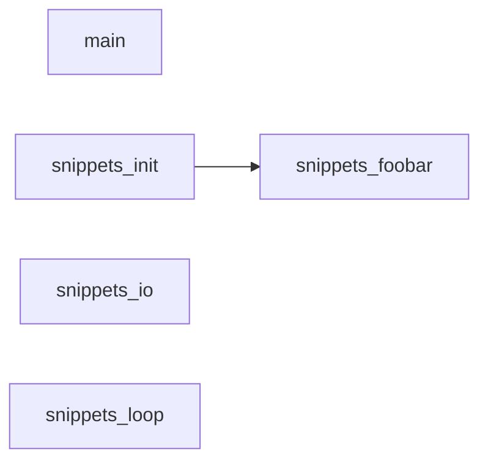

# Reverse-Engineered Architecture

## Module Block Diagram

```mermaid
flowchart LR
  main["main"]
  snippets_foobar["snippets_foobar"]
  snippets_init["snippets_init"]
  snippets_io["snippets_io"]
  snippets_loop["snippets_loop"]
  snippets_init --> snippets_foobar
```

## OOP Class Map

```mermaid
classDiagram
```