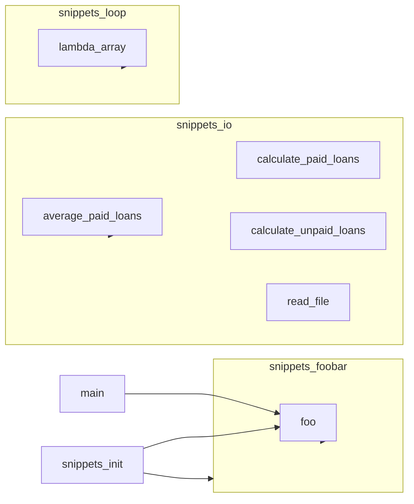

# Reverse-Engineered Architecture

## Overview

| Metric | Value |
|---|---|
| Modules | 5 |
| Classes | 0 |
| Functions | 6 |
| Dependencies | 9 (9 call) |

- **Most central:** `snippets_io` (0.40), `snippets_foobar_foo` (0.30), `snippets_foobar` (0.20)
- **Single points of failure (articulation points):** `snippets_foobar_foo`, `snippets_io`
- **Highest blast radius:** `snippets_foobar_foo` (3), `snippets_foobar` (1), `snippets_io_average_paid_loans` (1)
- **Dependency cycles:** none

## Block & Call Graph

## OOP Class Map

_No classes found — this codebase is module/function-only._
