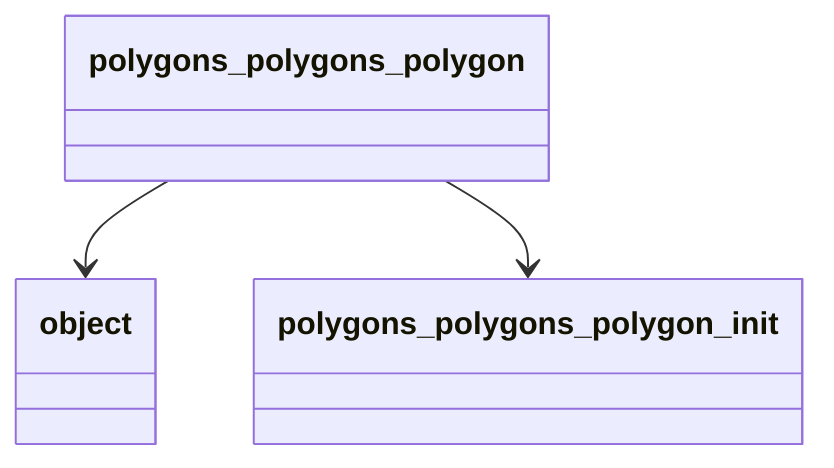

# Reverse-Engineered Architecture

## Overview

| Metric | Value |
|---|---|
| Modules | 5 |
| Classes | 2 |
| Functions | 9 |
| Dependencies | 12 (12 call) |

- **Most central:** `polygons_polygons_polygon` (0.27), `mathsquiz_mathsquiz_step2` (0.20), `mathsquiz_mathsquiz_step3` (0.20)
- **Single points of failure (articulation points):** `mathsquiz_mathsquiz_step2`, `mathsquiz_mathsquiz_step3`, `polygons_polygons`, `polygons_polygons_polygon`
- **Highest blast radius:** `object` (3), `polygons_polygons_polygon_init` (3), `polygons_polygons_polygon` (2)
- **Dependency cycles:** none
- **Orphan components:** `mathsquiz_mathsquiz`, `mathsquiz_mathsquiz_step1`

## Block & Call Graph

```mermaid
flowchart LR
  mathsquiz_mathsquiz["mathsquiz_mathsquiz"]
  mathsquiz_mathsquiz_step1["mathsquiz_mathsquiz_step1"]
  subgraph mathsquiz_mathsquiz_step2["mathsquiz_mathsquiz_step2"]
    mathsquiz_mathsquiz_step2_ask_question["ask_question"]
    mathsquiz_mathsquiz_step2_print_final_scores["print_final_scores"]
    mathsquiz_mathsquiz_step2_welcome_message["welcome_message"]
  end
  subgraph mathsquiz_mathsquiz_step3["mathsquiz_mathsquiz_step3"]
    mathsquiz_mathsquiz_step3_ask_question["ask_question"]
    mathsquiz_mathsquiz_step3_print_final_scores["print_final_scores"]
    mathsquiz_mathsquiz_step3_welcome_message["welcome_message"]
  end
  subgraph polygons_polygons["polygons_polygons"]
    polygons_polygons_calc_polygon_details["calc_polygon_details"]
    polygons_polygons_draw_polygon["draw_polygon"]
    polygons_polygons_polygon_init["polygon_init"]
  end
  mathsquiz_mathsquiz_step2 --> mathsquiz_mathsquiz_step2_ask_question
  mathsquiz_mathsquiz_step2 --> mathsquiz_mathsquiz_step2_print_final_scores
  mathsquiz_mathsquiz_step2 --> mathsquiz_mathsquiz_step2_welcome_message
  mathsquiz_mathsquiz_step3 --> mathsquiz_mathsquiz_step3_ask_question
  mathsquiz_mathsquiz_step3 --> mathsquiz_mathsquiz_step3_print_final_scores
  mathsquiz_mathsquiz_step3 --> mathsquiz_mathsquiz_step3_welcome_message
  polygons_polygons --> polygons_polygons_calc_polygon_details
  polygons_polygons --> polygons_polygons_draw_polygon
```

## OOP Class Map

