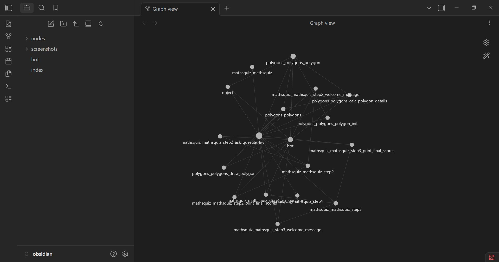
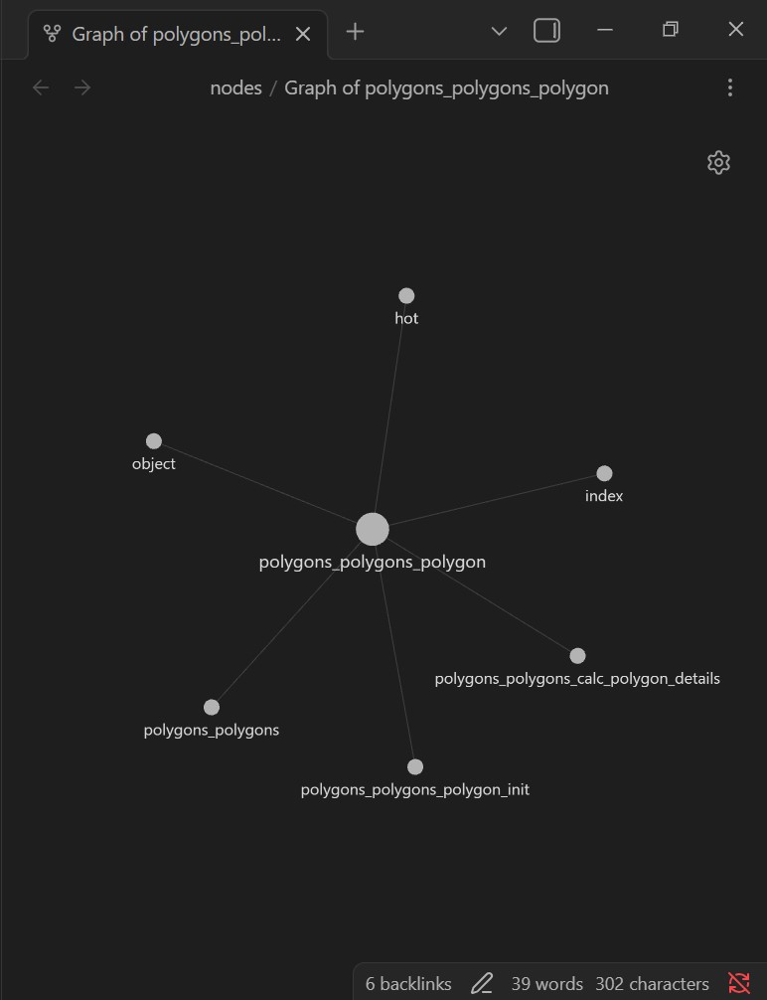
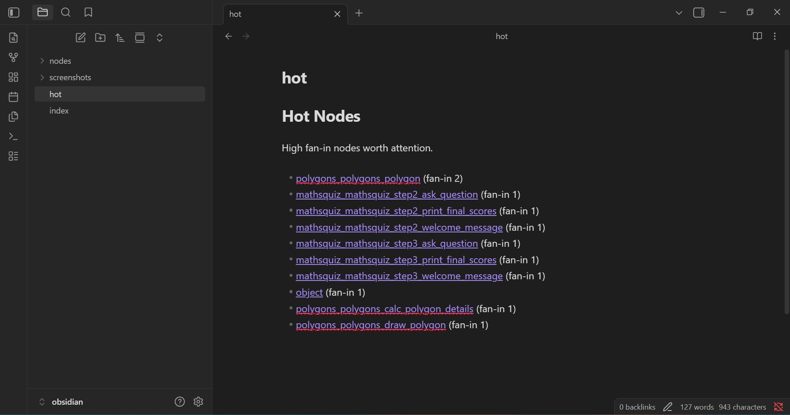
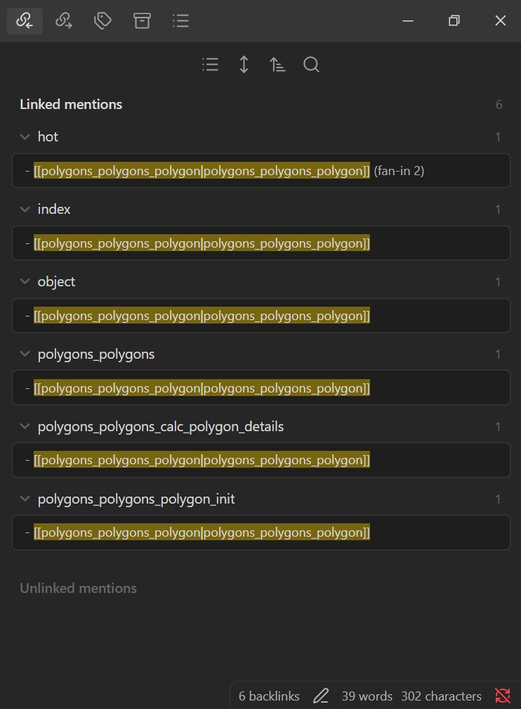

# Before / After — Architecture & Knowledge Level

Target: **[`martinpeck/broken-python`](https://github.com/martinpeck/broken-python)** · model `claude-opus-4-8`.
Companion to this run's [`FINDINGS.md`](../FINDINGS.md); mirrors the buggy-python
[`reports/before_after.md`](../../../reports/before_after.md) for a second, larger target.

What we understood **before** the graph, and what changed **after** running ArchAgent —
at the *code/architecture* level and the *knowledge* level (the Obsidian vault).

---

## 1. Architecture: before vs after

### Before (first glance)
A flat checkout: two small programs — a `mathsquiz` quiz and a `polygons` geometry
module (5 modules / ~446 LOC). From the directory listing alone there is **no signal**
about which parts are central, how they depend on each other, or where the structural
risk sits. They look like two unrelated exercise scripts.

### After (graph-derived, [`artifacts/graph.json`](../artifacts/graph.json) — 16 nodes, 12 edges)
Grphify's AST extraction + our metrics revealed structure the directory hid:

| Insight | Evidence |
|---|---|
| **The `Polygon` class is the structural core** | highest degree centrality **0.27**, fan-in **2**, fan-out **2** |
| **`Polygon` is a single point of failure** | **articulation point** — removing it disconnects the graph (Graphify independently flags it as the #1 God Node and a cross-community bridge, betweenness 0.085) |
| Other SPOFs | `polygons_polygons`, `mathsquiz_mathsquiz_step2`, `mathsquiz_mathsquiz_step3` |
| Orphan components | `mathsquiz_mathsquiz`, `mathsquiz_mathsquiz_step1` — standalone scripts, no call edges |
| No dependency cycles | Tarjan SCC found none |

→ 2 evidence-backed findings (God Node + SPOF on the same node), ranked in
[`reports/recommendations.md`](recommendations.md). The block diagram + a **real OOP class
map** (`Polygon` → `object`, unlike buggy-python which had no classes) are in
[`reports/architecture.md`](architecture.md).

**What wasn't obvious at first glance:** that the `Polygon` class — not either program's
entry point — is the load-bearing node, and that it is a *topological bottleneck* whose
removal fragments the graph. That is exactly where a change is riskiest.

---

## 2. Knowledge level: the Obsidian vault, before vs after

### Before
No knowledge base — only source files.

### After ([`obsidian/`](../obsidian/))
ArchAgent wrote a browsable vault:

- **`index.md`** — entry point: node/edge counts and every node grouped by type, each a `[[wikilink]]`.
- **`hot.md`** — the high-fan-in nodes worth attention first (`polygons_polygons_polygon` on top, fan-in 2).
- **`nodes/*.md`** — one note per node (16 notes), each linking to what it *depends on* and what *depends on it*, so Obsidian's graph view renders the dependency structure.

**How understanding changed:** the vault turns "two scripts" into a navigable map where
the `Polygon` hub is visually central and one click from everything that depends on it —
the same insight the metrics quantified, now explorable by a human.

---

## 3. Code level: structural risk localization

Unlike buggy-python (a single canonical line-level bug), this target's signal is
*structural*: the analysis localized risk to one node before reading its source. The
Architect agent (Opus) then returned an **evidence-gated** plan rather than a blind
refactor:

| | Before (as found) | After (recommended path) |
|---|---|---|
| `Polygon` status | God Node **and** articulation point, severity unconfirmed | quantify blast radius first; only then act |
| First action | — | **disprove the SPOF cheaply** (search for a bypass path) |
| Fix lever | — | add a redundant path to remove the articulation point — *before* any decomposition |
| Decomposition | — | **last**, and only if fan-in reflects genuinely mixed responsibilities |

That posture — *cheap disconfirmation → availability → maintainability*, with two of four
steps being gates that can halt the work — is the right call on a `[low]`-severity node,
and it is exactly the structure-first discipline the graph enables. Full text in
[`reports/recommendations.md`](recommendations.md).

---

## 4. Token efficiency (this run)

| Metric | Baseline (raw code) | Graph-guided |
|---|---|---|
| Total tokens | 3541 | 932 |
| Files read | 5 | 2 |
| Units read | 460 | 45 |
| Time to root cause (s) | 18.3 | 7.4 |

**73.7% fewer tokens** (≥40% target met), both reaching the root cause with tests green.
Full table in [`reports/token_efficiency.md`](token_efficiency.md); the cross-target
contrast (vs the flat `bugsinpy` corpus) is in [`../README.md`](../../README.md).

---

## 5. Screenshots

Captured from this run's generated vault. To reproduce, open `runs/broken-python/obsidian`
as a vault in Obsidian — the committed Markdown is the same content these views render.

**Graph view — the whole dependency structure.** Every node wired by its `[[wikilinks]]`;
`polygons_polygons_polygon` sits in the dense centre.

**Local graph of `polygons_polygons_polygon` (the hub).** It is the centre of its
neighbourhood — `object`, `index`, `hot`, `polygons_polygons`, `calc_polygon_details`, and
`polygon_init` all connect to it, matching its God-Node/SPOF ranking.

**`hot.md` — the risk surface.** Nodes ranked by fan-in, `polygons_polygons_polygon` at the
top (fan-in 2): the vault points the reader straight at the highest-risk node.

**A node note + Backlinks — navigability.** Opening `polygons_polygons_polygon` shows its
**6 linked mentions** (what depends on it), so the graph is browsable, not just viewable.

